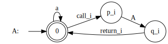
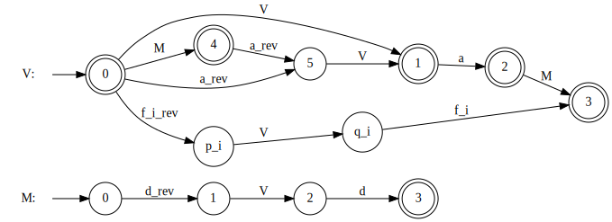
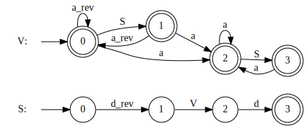
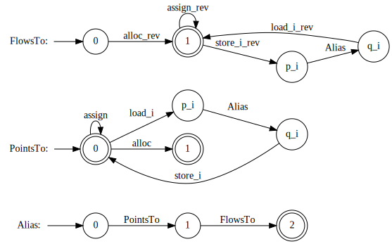
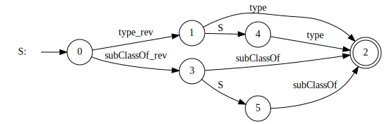

# RSM templates

We use **x_rev** to denote $\overline{x}$ (**x_i_rev** for $\overline{x_i}$ respectively).

## Context-sensitive data flow

Also known as aa.cnf

Based on grammar form bachelor thesis if Ilia Muravev ["Optimisation of the context-free language reachability matrix-based algorithm"](https://dspace.spbu.ru/items/abde4554-1852-44ad-9db3-0d7a19869884).

## Field-sensitive alias analysis

Also known as vf.cnf

Based on grammar form bachelor thesis if Ilia Muravev ["Optimisation of the context-free language reachability matrix-based algorithm"](https://dspace.spbu.ru/items/abde4554-1852-44ad-9db3-0d7a19869884).

## C alias analysis
Also known as c_alias.cnf

From master thesis of Vladimir Kutuev ["Experimental investigation of context-free-language reachability algorithms as applied to static code analysis"](https://dspace.spbu.ru/items/36014e9c-fae5-4793-9f17-7c1ddfc3421c).

## Java points-to analysis

Also known as java_points_to.cnf

From master thesis of Vladimir Kutuev ["Experimental investigation of context-free-language reachability algorithms as applied to static code analysis"](https://dspace.spbu.ru/items/36014e9c-fae5-4793-9f17-7c1ddfc3421c).

## RDF hierarchy analysis

Basd on grammar form [CFPQ_Data](https://formallanguageconstrainedpathquerying.github.io/CFPQ_Data/graphs/data/skos.html#skos).

